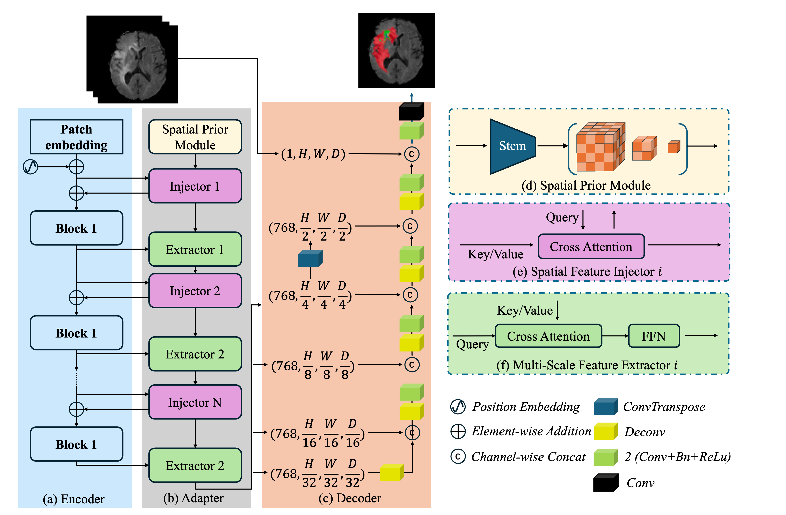

# MedViT-UNETR: Hybrid Vision Transformer for 3D Medical Image Segmentation

## Introduction
***MedViT-UNETR*** is a novel deep learning framework designed to harness the power of Vision Transformers (ViT) adapter and UNETR for accurate and efficient 3D medical image segmentation. By combining the strengths of both models, ***MedViT-UNETR*** is capable of capturing global contextual information and fine-grained details essential for segmenting complex anatomical structures in medical images.

## Structure Description
ViT-UNETR is structured as a hybrid model that utilizes the following components:

- **ViT Encoder**: The backbone of the model is based on the Vision Transformer architecture, which is known for its dynamic modeling capabilities and long-range dependence through the attention mechanism. The ViT encoder processes the input images to learn powerful representations from large-scale multi-modal data.

- **Adapter Module**: An adapter is introduced to bridge the gap between the ViT encoder and the UNETR decoder. This module consists of a spatial prior module, spatial feature injector, and multi-scale feature extractor. It adapts the plain ViT to dense prediction tasks by injecting image-related inductive biases and reconstructing multi-scale features at resolutions (H/4, W/4, D/4), (H/8, W/8, D/8), (H/16, W/16, D/16), and (H/32, W/32, D/32).

- **UNETR Decoder**: The decoder part follows the U-shaped network design from UNETR, which is specifically tailored for 3D segmentation tasks. It uses a series of convolutional layers and upsampling operations to refine the segmentation output, merging the features from the ViT encoder through skip connections at multiple resolutions.

- Model structure is shown in the image below:

  

## Acknowledgements
Many thanks to following codes that help us a lot in building this codebase:

- [Vision Transformer Adapter for Dense Predictions](https://arxiv.org/abs/2205.08534)
- [UNETR: Transformers for 3D Medical Image Segmentation](https://arxiv.org/abs/2103.10504)
- [CoTr: Efficient 3D Medical Image Segmentation by bridging CNN and Transformer](https://github.com/YtongXie/CoTr/tree/main)

## Contact
For any questions, suggestions, or collaboration inquiries, please reach out to us.